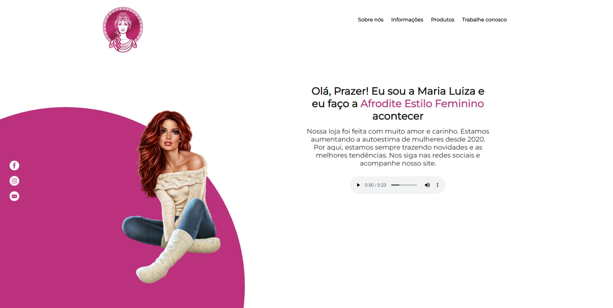

# Loja virtual

> Site simulando um e-commerce de roupas femininas. Projeto criado para um trabalho da faculdade.

## 💻 Tecnologias
Este projeto foi desenvolvido com as seguintes tecnologias:

* HTML
* CSS
* JAVASCRIPT

 

  💌 Entre em contato comigo: ⤵️

  

  

  

  

  
